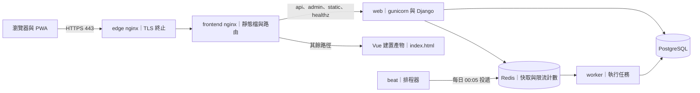
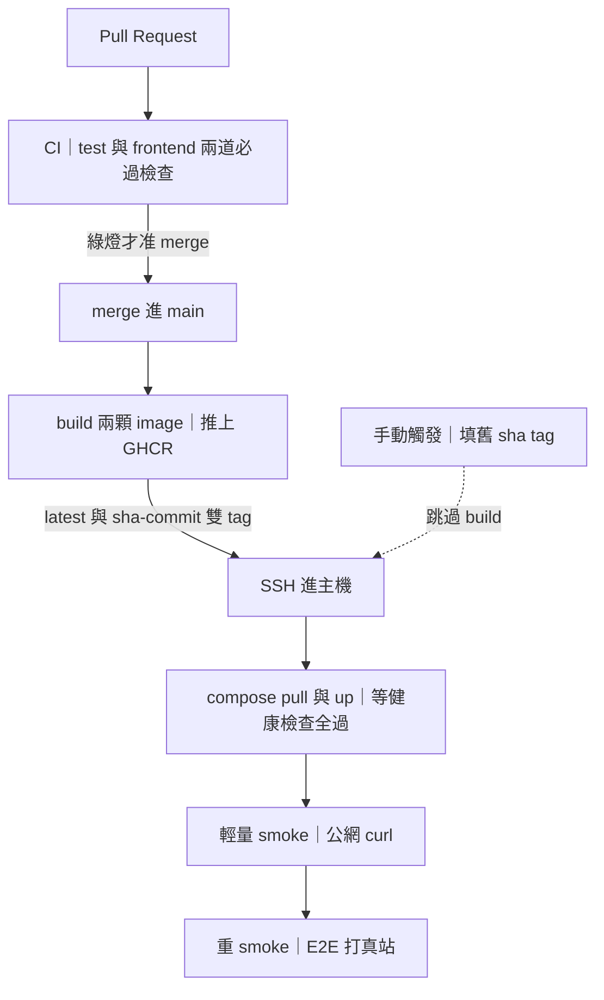

# 架構

## 這是什麼

一個記帳的 REST API 與它的 Vue 前端：帳戶、分類、標籤、交易、儲蓄目標、定期定額與帳戶間轉帳，加上一組報表聚合端點。認證走 JWT，資料一律依使用者隔離。

線上站：<https://shift725-ledger-api.duckdns.org>（可自行註冊試用）。

規模給個概念：後端 233 個測試、覆蓋率 95.25%，前端 189 個測試，另有打真站的端對端煙測；一次 merge 到上線約三分鐘、全自動。

本文件講**形狀**——有哪些東西、誰負責什麼、一個請求怎麼穿過去。想知道怎麼把整站從零架起來，看 [`DEPLOYMENT.md`](DEPLOYMENT.md)。

## 系統形狀

八個容器，一個 `docker compose`。本機開發與線上跑的是同一份 compose，差別只在一層 overlay（`docker-compose.prod.yml`：換成建置好的 image、收掉對外 port）。

| 服務 | 職責 | 來源 |
|---|---|---|
| `db` | PostgreSQL 16，唯一的真相 | 認證核心 |
| `web` | gunicorn ＋ Django／DRF，全部業務邏輯 | 認證核心 |
| `nginx` | 邊界 TLS 終止器，只做 HTTPS 與轉發，不碰路由 | 認證核心 |
| `certbot` | 憑證簽發與每 12 小時續簽 | 認證核心 |
| `redis` | 快取（db 0）與任務佇列（db 1），一顆兩用途 | 本專案 |
| `worker` | 執行背景任務 | 本專案 |
| `beat` | 排程器，到點把任務投進佇列 | 本專案 |
| `frontend` | nginx 服 Vue 建置產物，並反代 API | 本專案 |

三件值得知道的事：

- **`web`／`worker`／`beat` 是同一顆 image，只換 `command`**。三者連線設定由 compose 頂層的 `x-app-env` 錨點定義一次、三處引用——改一個地方，不會漏改其中一個而漂掉。
- **`nginx` 與 `certbot` 在 `tls` profile 裡**，本機開發不啟動；本機只需要 `frontend` 的 80 埠。
- **線上不對外開 `web:8000` 與 `frontend:80`**（`ports: !reset []`）。Docker 的 port publish 走 iptables DNAT、會繞過 ufw，所以「防火牆有擋」是錯覺；唯一可靠的作法是不 publish，流量只從 edge 的 443 進來。

本專案的認證部分（`accounts/`）與容器骨架繼承自一個獨立的認證核心 repo，透過 git upstream 合併取得更新（`git remote -v` 看得到 upstream，且已鎖 `no_push`）。記帳領域（`ledger/`）與前端（`frontend/`）是本專案長出來的——這也是為什麼兩個 app 的測試風格不同：核心的照原樣保留，新的一律 pytest 風格。

## 一個請求的生命週期

以「登入後載入交易列表」為例：

1. **瀏覽器 → edge nginx（443）**。edge 只做兩件事：終止 TLS、把 80 埠一律 301 導到 443（唯一例外是 ACME challenge 路徑，續簽要走它）。它不認識任何業務路由。
2. **edge → frontend nginx**（內網明文）。edge 在這裡標上 `X-Forwarded-Proto: https`——**它是唯一有資格斷言原始協定的一跳**，因為只有它直接面對瀏覽器。
3. **frontend nginx 是唯一的路由表**：`/api/`、`/admin/`、`/static/` 與 `= /healthz` 反代給 `web:8000`，其餘路徑一律 `try_files → index.html` 交給前端路由（深連結重整不會 404）。
   - 這一跳**只透傳** `X-Forwarded-Proto`、不重新斷言：它自己這一跳恆為 http，若照本跳的 `$scheme` 覆寫，Django 會永遠以為連線不安全。
   - 反代目標寫成變數並指定 Docker 內建 DNS（`resolver 127.0.0.11`），每次請求才解析。寫死主機名的話 nginx 只在啟動時解析一次，`web` 一重建換了 IP 就會持續打到不存在的舊位址。
4. **web：gunicorn → Django**。`SECURE_PROXY_SSL_HEADER` 只在 `TLS_BEHIND_PROXY` 開啟時才掛上——預設關閉，所以本機與 CI 完全不受影響，也避免「任何 client 自稱 https 就被當成安全連線」。
5. **DRF 四道關卡**，順序即防線：
   1. **JWT 認證**（access／refresh 雙 token，refresh 輪換並帶黑名單）。
   2. **限流**：匿名 60／分（依 IP）、登入 300／分（依使用者）、最重的餘額走勢報表 20／分。計數存在 Redis，所以跨 gunicorn worker 一致——不會因為多開幾個 worker 就變相放寬成三倍。
   3. **ViewSet**：所有業務資源共用 `OwnedModelViewSet` 基底，`get_queryset()` 一律依 `request.user` 過濾，`perform_create()` 一律寫入 `user=request.user`。
   4. **Serializer**：`__init__` 把關聯欄位（帳戶／分類／標籤）的可選 queryset 收斂到本人。
6. **PostgreSQL**。

**兩層隔離的分工是刻意的**：第 5.3 關擋的是「你能碰哪一筆」，第 5.4 關擋的是「你能引用誰的資源」。少了第二層，使用者仍可以把交易掛到別人的帳戶上——因為那筆交易本身確實是他的。跨使用者的資源一律回 **404 而不是 403**：403 等於承認那筆資料存在。

交易列表另外用 `select_related`（外鍵）與 `prefetch_related`（多對多）把查詢數與資料筆數脫鉤，現行鎖定值是 3 次查詢（計數、主查詢、標籤預抓），並有測試斷言看守。

### 兩條旁路

- **快取**：餘額走勢是唯一全歷史、成本隨終身交易數成長的報表，只有它做 cache-aside（TTL 300 秒，暖讀 0 次資料庫查詢）。失效掛在交易寫入的 `transaction.on_commit` 上——**必須等 commit 之後才清**，否則並發的讀取者會拿還沒提交的舊資料回填快取，髒值撐滿整個 TTL。
- **排程**：`beat` 每天 00:05（專案時區）投遞一個任務，`worker` 把到期的定期定額規則轉成實際交易。挑 00:05 不挑 00:00：整點是各家排程的尖峰，而且跨日邊界剛過一點再跑，「今天」的判定不會踩在午夜那一瞬。

健康探針 `/healthz` 是純 Django view、不經 DRF——探針不該吃限流額度，否則高頻探測會把自己打成 429，被編排系統誤判為不健康而反覆重啟。它會實際檢查資料庫與快取，任一不通回 503。

## 資料模型

六個 model，全部繼承同一個抽象基底（UUIDv7 主鍵＋建立／更新時間）：**帳戶、分類、標籤、交易、儲蓄目標、定期定額規則**。金額欄位一律 `DecimalField`，不用浮點數。

**最重要的不變式：`Account.balance` 是衍生值，交易紀錄才是真相。** 餘額由交易維護（`F()` 表達式原子遞增，允許負值），對外唯讀。這條決定了很多事：期初餘額用第一筆交易表達；任何時候都能從交易重算出餘額來對帳；並發的兩筆記帳不會互相覆蓋，因為遞增發生在資料庫端而不是「讀出來加一加再寫回去」。

三條約束值得單獨講，因為它們把正確性放在資料庫而不是應用層：

- **每人每名唯一**（帳戶／分類／標籤各一條），以及**每人最多一個預設帳戶**（帶條件的唯一約束）。
- **一條定期定額規則的同一個到期日，最多一筆交易**。這是自動記帳的冪等保證：重複投遞、並發的 worker、任務重試全都撞在這條索引上，不必在應用層上鎖——**鎖只保護記得上鎖的那條路徑，約束保護全部路徑**（包括管理後台、匯入腳本、以及日後某次寫錯的重試）。手動交易的來源規則是 NULL，而 PostgreSQL 預設 NULL 互不相等，所以完全不受這條限制。
- 交易對帳戶是 `PROTECT`：有交易的帳戶刪不掉（回 409），避免留下無主的金額。

**轉帳是兩腿**：一次 `POST` 在同一個交易中建立兩筆——轉出記支出、轉入記收入，兩筆都標記為轉帳。它們刻意**不計入收支統計**：所有收支報表都經過同一個 `_txns_in_range` 取資料，那裡尾接一句排除，所以「不重複計算」這件事只實作一次。而帳戶餘額與餘額走勢**不經**那個函式，因此仍照實反映轉帳造成的資產移動。兩腿金額可以不同，差額就是手續費。

## 契約鏈

`openapi.yaml` 落檔在 repo 根，是對前端凍結的契約（目前 v1.1.0、28 個端點）。它由後端的 view 與 serializer 推導產生，不手工維護。真正讓它不腐化的是**兩道方向相反的機器看守**：

| 方向 | 誰看守 | 壞掉時 |
|---|---|---|
| 落檔 ＝ 程式 | 後端測試現場重新產生 schema，與落檔做語意比對 | 改了 API 形狀卻沒重新匯出 → 測試紅 |
| 型別 ＝ 落檔 | CI 重新產生前端型別後 `git diff --exit-code` | 契約變了卻沒重生型別 → CI 紅 |

兩道合起來，鏈路是閉合的：**後端不能偷改形狀，前端不能拿舊型別。** 契約變更因此變成一件有儀式的事——重新匯出、依語意化版本升版（只加不改是 minor、破壞相容是 major），而不是某次 PR 裡順手改掉的一行。前端的 API 型別完全由這份契約產生，不手寫。

## 從 merge 到上線

`main` 受保護，兩道檢查必須綠才准 merge：**test**（ruff、pytest、覆蓋率門檻）與 **frontend**（lint、格式、型別檢查、單元測試、建置、PWA 產物斷言、無障礙守門、契約型別未漂移）。

merge 之後全自動，一次 merge 就是一頁 log：

1. **build 兩顆 image 推上 GHCR**，各帶兩個 tag——`latest` 是日常預設（會漂移），`sha-<commit>` 是不可變的錨點。
2. **SSH 進主機**。金鑰與主機指紋都來自 secrets，指紋是釘死的（不用「不驗主機金鑰」那條捷徑）。`.env` 以 secrets 為唯一正本，部署時 render 上主機。
3. **`compose pull` 然後 `up --wait`**，等所有健康檢查通過；等不到（例如壞掉的設定讓 web 永遠不健康）就以失敗收場，而不是回報成功。
4. **兩級 smoke**：輕的從公網 curl 健康探針與首頁，順帶驗整條 DNS→TLS→edge→前端→後端；重的把同一套 E2E 換個 base URL 打真站，跑完整命脈（註冊→建帳戶→記一筆→列表看到→登出）。

兩個設計重點：

- **部署的必須是 CI 驗過的那顆 artifact**。主機只 pull、不 build，而且一律釘不可變的 `sha-<commit>`——「測的那顆」與「上線那顆」是同一個東西，不是同一份原始碼各自建一次。
- **rollback 不需要 revert commit**：手動觸發時填入舊的 sha tag，build 整個跳過，直接部署 registry 上那顆不可變的舊 image。部署本身也序列化，兩支 PR 接連 merge 不會互踩。

## 刻意不做

這些都評估過而且沒做，理由不是「來不及」：

- **Kubernetes**：單機、單一使用者，一份 compose 就完整表達了拓撲。k8s 給的是多節點排程與自動擴縮，這裡沒有這個問題，維護成本卻是實打實的。
- **staging 環境**：多一套環境就多一份會漂移的設定。PR 的兩道檢查擋住「會不會壞」，部署後的兩級 smoke 擋住「上線後活不活著」，中間那層在這個規模買不到東西。
- **錯誤追蹤服務**：結構化的 JSON 日誌加上健康探針，已經足以定位問題；使用者只有作者一人時，錯誤回報鏈路就是自己。有第二個使用者時這條會第一個被推翻。
- **blue-green 部署**：量過了——部署停機窗 8 秒、全部是 502、零連線被拒。以唯一使用者是作者本人來說，這 8 秒買不回雙色部署的實作與長期維護成本（每次改欄位都要拆成兩次部署）。設計已經寫下來，要做的時候不必從頭想：[`ADR-0001-blue-green.md`](ADR-0001-blue-green.md)。
- **離線衝突解決**：前端離線只做一件事——把「新增交易」排進佇列，回線自動補送。離線編輯與刪除牽涉順序與衝突，是另一個量級的問題，而記帳真正的離線需求就是「當場記一筆」。
- **煙測失敗自動回滾**：偶發的網路抖動會誤觸回滾，把一次正常部署變成兩次非預期變更。現在的作法是停在紅燈、由人看一眼再決定——反正回滾只需要填一個 sha。

## 想更深入

| 想知道 | 看這裡 |
|---|---|
| 怎麼從裸機把整站架起來 | [`DEPLOYMENT.md`](DEPLOYMENT.md) |
| 部署停機窗的量測與雙色部署設計 | [`ADR-0001-blue-green.md`](ADR-0001-blue-green.md) |
| 開發流程與規範 | [`CONTRIBUTING.md`](CONTRIBUTING.md) |
| API 契約 | [`openapi.yaml`](openapi.yaml)，或線上站的 `/api/docs/` |
| 使用者隔離怎麼實作 | [`ledger/views.py`](ledger/views.py)、[`ledger/serializers.py`](ledger/serializers.py) |
| 報表聚合與快取 | [`ledger/reports.py`](ledger/reports.py) |
| 定期定額的冪等 | [`ledger/tasks.py`](ledger/tasks.py)、[`ledger/models.py`](ledger/models.py) |
| 限流、排程、反代設定 | [`config/settings.py`](config/settings.py) |
| 路由表 | [`frontend/nginx.conf`](frontend/nginx.conf) |
