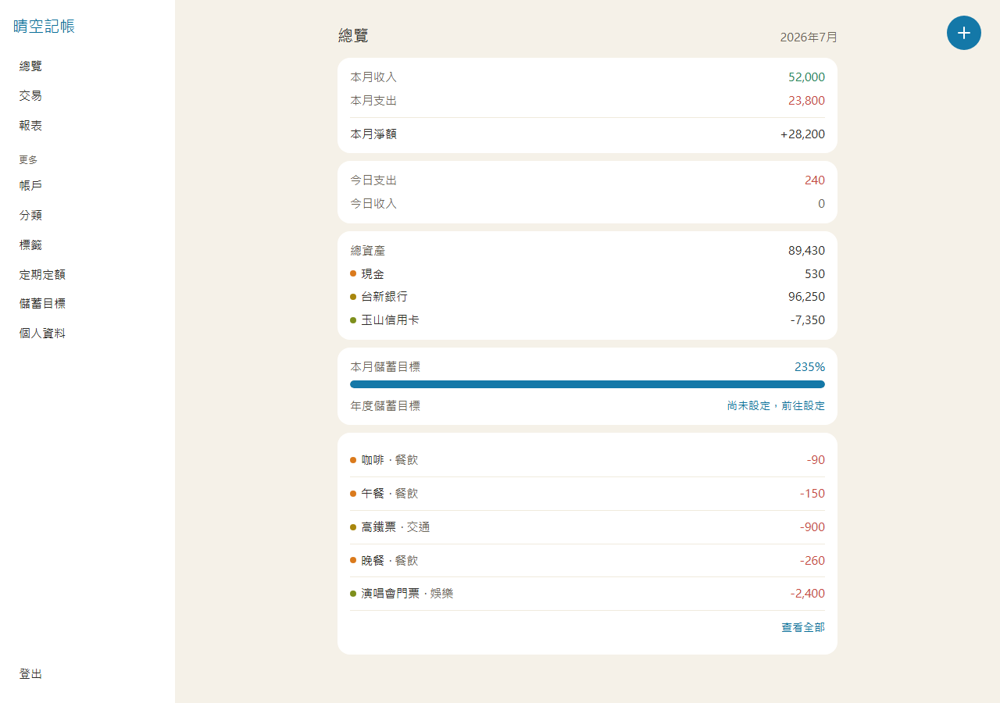
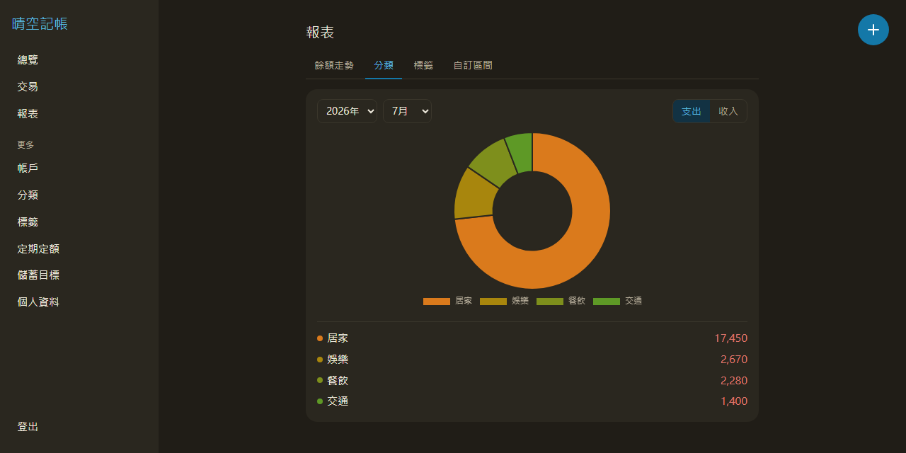
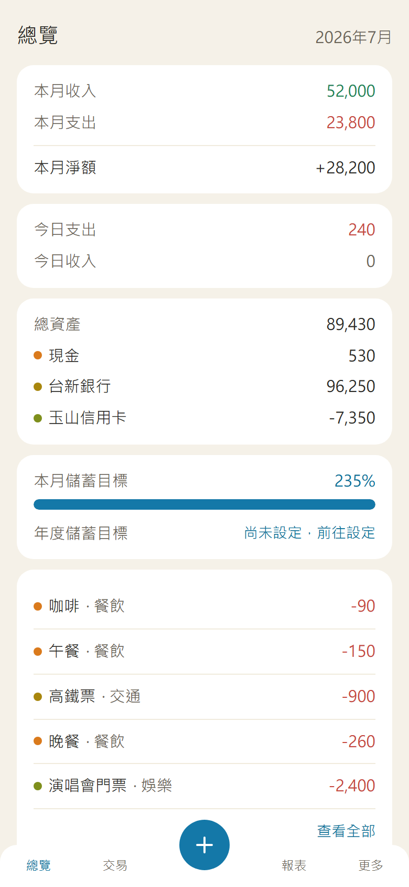
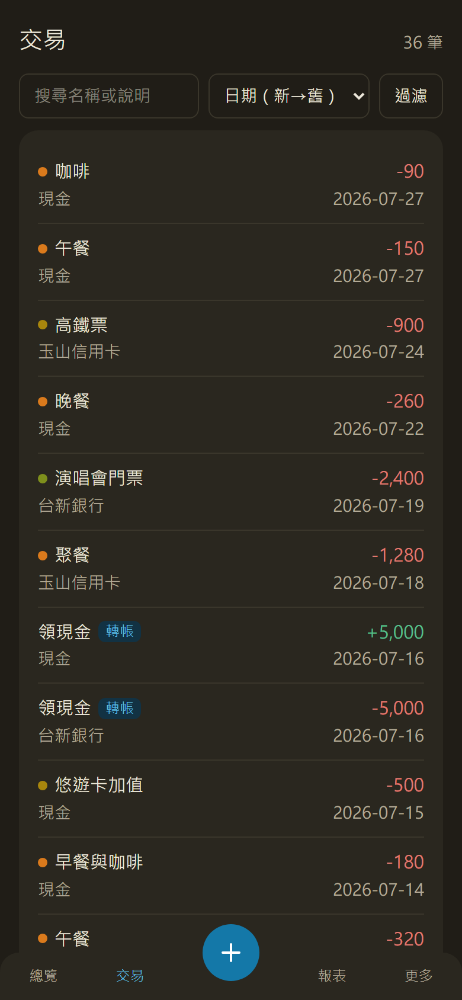

# ledger-api · 晴空記帳

[](https://github.com/shift725/ledger-api/actions/workflows/ci.yml)

**線上 demo**：<https://shift725-ledger-api.duckdns.org>（可自行註冊試用）

一套個人記帳服務：Django REST Framework 後端 ＋ Vue 3 PWA 前端，八個容器一份 `docker compose`，push 到 `main` 就自動建置、部署、煙測上線。





同一份程式在手機上換成底部導覽列與中央記帳鈕；深淺色跟隨系統設定：

<p>
  
  
</p>

## 功能

| 範疇 | 內容 |
|---|---|
| 記帳 | 帳戶、分類、標籤、交易的完整 CRUD；跨帳戶轉帳（單筆建立兩腿，差額即手續費，且不計入收支統計） |
| 報表 | 本月收支、今日收支、分類與標籤分佈、多帳戶餘額走勢、自訂日期區間、儲蓄目標達成率 |
| 自動記帳 | 定期定額規則；每天 00:05 由排程把到期規則轉成當期交易，停機期間會補齊 |
| 查找 | 關鍵字搜尋、日期／帳戶／分類過濾、多標籤（任一／全部）過濾、排序與分頁 |
| PWA | 可安裝到桌面；**離線也能記一筆**，回線自動補送 |
| 介面 | 響應式（手機底部導覽／桌面側欄）、深淺色跟隨系統 |
| 帳號 | JWT 登入，refresh 輪換＋登出黑名單；業務資料一律依使用者隔離，跨使用者一律 404 |

## 技術棧

- **後端** — Python 3.12 · Django 6.0 · DRF 3.17 · SimpleJWT · PostgreSQL 16（psycopg3）· Redis 8（快取與限流計數）· Celery（`worker` ＋ `beat`）· gunicorn ＋ WhiteNoise
- **前端** — Vue 3 ＋ TypeScript · Vite · Pinia · Vue Router · Tailwind CSS v4 · Chart.js · vite-plugin-pwa
- **基建** — Docker 多階段建置 ＋ Compose 八服務（`db`／`redis`／`web`／`worker`／`beat`／`frontend`／`nginx`／`certbot`）· GitHub Actions CI ＋ 自動部署（GHCR → VPS）· Let's Encrypt 自動續簽
- **品質工具** — Ruff · coverage · pytest · Vitest · Playwright · pre-commit

## 品質與規模

後端 **233** 個測試、覆蓋率 **95.25%**（CI 門檻 75%）；前端 **189** 個測試；另有打線上站的端對端煙測。API 契約 `openapi.yaml` 目前 **v1.1.0／28 個端點**，由後端測試與前端型別產生器**雙向看守**——後端偷改形狀會紅，前端拿舊型別也會紅。一次 merge 到上線約 **三分鐘**，全自動。

## 快速開始

需求：Docker Desktop 或 Docker Engine 20.10+（含 Compose v2）。

```bash
git clone <repo-url> ledger-api
cd ledger-api
cp .env.example .env          # 範例值即可跑起來
docker compose up -d --build  # 首次 build 約 2–3 分鐘
```

起來的是六個服務（`db`／`redis`／`web`／`worker`／`beat`／`frontend`）。`nginx` 與 `certbot` 屬 TLS profile，本機不啟動。

| 位置 | 是什麼 |
|---|---|
| <http://localhost> | 應用程式 |
| <http://localhost/api/docs/> | Swagger UI（互動式 API 文件） |
| <http://localhost/admin/> | Django admin（帳密見 `.env`） |
| <http://localhost/healthz> | 健康探針，實際檢查資料庫與快取 |

前端與 API 同源（`frontend` 的 nginx 把 `/api`、`/admin`、`/static` 反代給 Django），所以只需要這一個 port，也沒有 CORS 問題。

> **正式環境務必換掉** `.env` 的 `SECRET_KEY` 與各組密碼——範例值是公開的。
> port 80 被占用的話，`.env` 加一行 `FRONTEND_PORT=8080`。

收工：`docker compose down` 停服務保留資料，`docker compose down -v` 連資料庫一起清空。

## 本機開發

**後端**（不經 Docker；需要一個可連的 PostgreSQL——`docker compose up -d db` 已把它開在 5433）：

```bash
python -m venv .venv
.venv\Scripts\Activate.ps1            # macOS／Linux：source .venv/bin/activate
pip install -r requirements-dev.txt   # runtime ＋ 開發工具
python manage.py migrate
python manage.py runserver
```

`DATABASE_URL` 要自己給（容器下由 compose 組好注入）；`.env.example` 裡有一行註解好的範例，取消註解即可。

**前端**（Vite dev server，含 hot reload）：

```bash
npm --prefix frontend ci
npm --prefix frontend run dev
```

dev server 會把 `/api` 代理到 `http://localhost:8000`，所以後端要起著（容器或 venv 皆可）。

## 測試與程式品質

```bash
# 後端（venv，需 DATABASE_URL）
coverage run -m pytest && coverage report   # 涵蓋 accounts、config、ledger；低於 75% 即失敗
ruff check . && ruff format --check .

# 前端
npm --prefix frontend run test:unit
npm --prefix frontend run lint
npm --prefix frontend run type-check

# 端對端煙測（打「已經起好的」棧；換 E2E_BASE_URL 就能打任何一站）
npm --prefix frontend run test:e2e
```

容器內只想跑測試的話用 Django 內建 runner（runtime image 刻意不含 pytest 與覆蓋率工具）：

```bash
docker compose exec web python manage.py test
```

`pre-commit install` 之後，每次 commit 會自動跑 Ruff 與前端的 lint／格式檢查。

## 想更深入

| 想知道 | 看這裡 |
|---|---|
| 系統形狀、一個請求怎麼穿過去、**刻意不做什麼** | [`ARCHITECTURE.md`](ARCHITECTURE.md) |
| 從裸機把整站架起來、日常維運與 rollback | [`DEPLOYMENT.md`](DEPLOYMENT.md) |
| 開發流程、commit 與 PR 規範 | [`CONTRIBUTING.md`](CONTRIBUTING.md) |
| 部署停機的量測與雙色部署設計 | [`ADR-0001-blue-green.md`](ADR-0001-blue-green.md) |
| API 契約 | [`openapi.yaml`](openapi.yaml)，或線上站的 `/api/docs/` |
| 每個環境變數的用途 | [`.env.example`](.env.example)（逐行註解） |
